# A Practical Guide to Orchestrate Everything

Welcome! This is the companion repository to the *A Practical Guide to Orchestrate Everything* talk at the [2026 Orchestrate Everything conference](https://www.astronomer.io/events/orchestrate-everything/).

It shows how to use [Apache Airflow®](https://airflow.apache.org/) for

- [ETL](/dags/etl/): loading a product catalogue
- [Context engineering](/dags/context_engineering/): chunking and embedding policy documents for retrieval
- [AI orchestration](/dags/ai_orchestration/): an LLM classifier that routes product reviews, and a tool-calling support agent with a human-in-the-loop review step
- [AI evals](/dags/ai_evals/): OTel trace ingestion, LLM-as-judge scoring, pass@k, and evaluating support outcomes against CSAT
- [MLOps](/dags/mlops/): training a delivery-risk classifier and scoring shipments against it

All of these Dags run **CosMarket**, a fictional ecommerce marketplace serving ships, stations, and colonies across the solar system. The data is stored in a [DuckDB](https://duckdb.org/) file. The only external service needed is an AI model provider, for which you need to provide the key in `.env`.

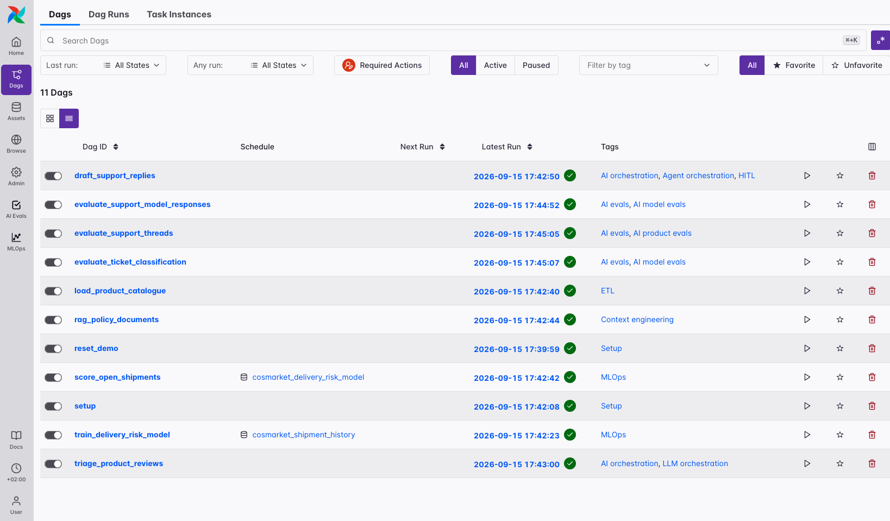

## Requirements

- Docker
- The [Astro CLI](https://www.astronomer.io/docs/astro/cli/install-cli)
- An OpenAI API key

## Setup

```bash
cp .env_example .env      # add your OPENAI_API_KEY or credential to another Pydantic AI compatible model provider
astro dev start
```

`astro dev start` starts six containers:

- `postgres`: Airflow's metadata database
- `scheduler`
- `dag-processor`
- `api-server`
- `triggerer`
- `otel-collector`: receives OTLP spans over gRPC/HTTP and appends them to `traces/spans.jsonl`

The `include/cosmarket.duckdb` file is the database Dags interact with. It is created by the `setup` Dag on first run, and a small custom provider (`include/cosmarket_duckdb`, installed via the `Dockerfile`) registers a `duckdb` connection type so `SQLToolset` and the SQL tasks can query it. 

`.env_example` defines:

- `AIRFLOW_CONN_DUCKDB_DEFAULT`: `{"conn_type": "duckdb", "host": "/usr/local/airflow/include/cosmarket.duckdb"}`
- `AIRFLOW_CONN_PYDANTICAI_DEFAULT`: `{"conn_type": "pydanticai", "extra": {"model": "openai:gpt-5-mini"}}`, the connection id `@task.llm`/`@task.agent` references. Note that if you want to use a different Pydantic AI compatible model provider, you'll need to set your credential as `password` and change the model. 
- `AIRFLOW__TRACES__OTEL_ON`, `AIRFLOW__COMMON_AI__OTEL_EXPORT_ENABLED`, `AIRFLOW__COMMON_AI__CAPTURE_CONTENT`: all three have to be `True` for a GenAI span to be emitted with its prompt and completion attached
- `OTEL_TRACES_EXPORTER`, `OTEL_EXPORTER_OTLP_TRACES_ENDPOINT`, `OTEL_SERVICE_NAME`: send the exporter's spans to the `otel-collector` container over OTLP/HTTP

Add your own `OPENAI_API_KEY` to `.env` after copying it.

## How to run the example

| # | Step | Notes |
|---|---|---|
| 0 | Unpause all Dags in the UI, or `astro dev run dags unpause --treat-dag-id-as-regex -y ".*"` | - |
| 1 | Run `setup` (or `reset_demo` for a clean slate) | Seeds customers, products, open support tickets, and shipment history |
| 2 | `train_delivery_risk_model` runs on its own | Triggered by the `cosmarket_shipment_history` asset that step 1 produces |
| 3 | `score_open_shipments` runs on its own | Triggered by the `cosmarket_delivery_risk_model` asset that step 2 produces |
| 4 | Run `load_product_catalogue`, `rag_policy_documents`, `draft_support_replies`, `triage_product_reviews` in any order | Each is a standalone pattern. Note that `draft_support_replies` has a human-in-the-loop step that will wait 5min for your decision. |
| 5 | Run `evaluate_support_model_responses` after `draft_support_replies` has produced at least one run | Scores that Dag's OTel traces against golden replies |
| 6 | Run `evaluate_ticket_classification` and `evaluate_support_threads` | Both work off their own fixtures, nothing upstream required |

## The Dags

### Setup (`dags/`)

| Dag | What it does |
|---|---|
| `setup` | Creates the schema and seeds customers, products, open support tickets, and shipment history. Safe to rerun: `CREATE TABLE IF NOT EXISTS` and upserts. |
| `reset_demo` | Drops every table, recreates the schema, reseeds, and empties the exported span file. Run this after changing `include/sql/cosmarket_schema.sql`, since `CREATE TABLE IF NOT EXISTS` won't add a column to a table that already exists. |

### ETL (`dags/etl/`)

| Dag | What it does |
|---|---|
| `load_product_catalogue` | Reads `include/csvs/products.csv`, casts and filters to active products, checks for duplicate SKUs and missing prices, and upserts into `products` |

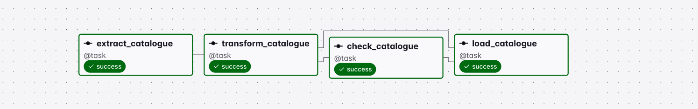

### Context engineering (`dags/context_engineering/`)

| Dag | What it does |
|---|---|
| `rag_policy_documents` | Chunks the five markdown policy documents in `include/seed_context/`, embeds each chunk with `text-embedding-3-small`, and upserts into `context_units`. Embeddings are a `FLOAT[]` column in DuckDB, no pgvector involved. The embed step checkpoints each chunk's vector in the task state store as it goes, so a retry only re-embeds the chunks that hadn't been embedded yet, not the whole document set. |

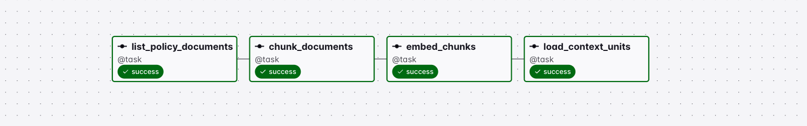

### AI orchestration (`dags/ai_orchestration/`)

| Dag | What it does |
|---|---|
| `draft_support_replies` | An `@task.agent` drafts a reply to one open ticket, with a read-only `SQLToolset` scoped to four tables, a tool that looks up the order record behind the ticket, and a tool that searches the policy corpus. The task sets `durable=True`, so on retry each already-completed model and tool call replays from the task state store instead of re-running, as long as the prompt, model, and tools haven't changed since the failed attempt. Output is a Pydantic model naming the evidence and policy chunks used. `HITLBranchOperator` then routes the draft to send-as-drafted, respond-manually, escalate-to-on-call, or escalate-to-account-manager, defaulting to on-call escalation if no one responds within five minutes. |
| `triage_product_reviews` | An `@task.llm` classifies each fetched review into one of six categories with a confidence score, dynamically mapped one task group per review. A plain Python task, not the model, determines whether a low-confidence classification still routes to its team's queue or falls back to human triage, keeping that guardrail in Airflow rather than in the prompt. |

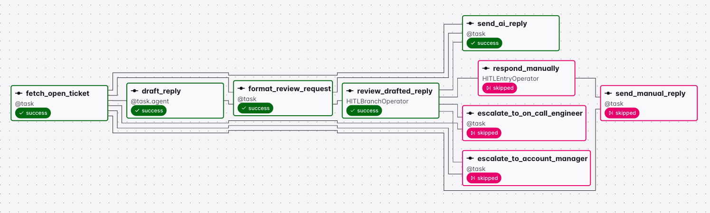

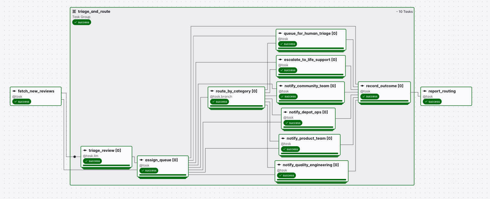

### AI evals (`dags/ai_evals/`)

| Dag | Method | Feeds the AI Evals plugin? |
|---|---|---|
| `evaluate_support_model_responses` | Reads `draft_support_replies` OTel traces, scores a rubric plus a comparison against a golden reply | Yes, writes `support_thread_evals` |
| `evaluate_ticket_classification` | Classifies each labelled ticket `k` times at temperature 1.0, reports pass@1, pass@k, and majority-vote accuracy | No, logs only |
| `evaluate_support_threads` | No traces. Joins already-sent support replies, the customer's actual reply, and CSAT survey scores by ticket, and judges accuracy, tone, sentiment, and escalation risk against that evidence | No, logs only |

`evaluate_support_model_responses` is the only one of the three that writes to `support_thread_evals`, the table the AI Evals plugin reads. The other two log their per-run records and rates to the task log and never show up in the plugin UI. `evaluate_support_threads` also judges something different from the other two: they score a single generated output against a golden answer, an "AI model eval," while this one scores what actually happened after a reply went out, an "AI product eval" against CSAT and the customer's own reply.

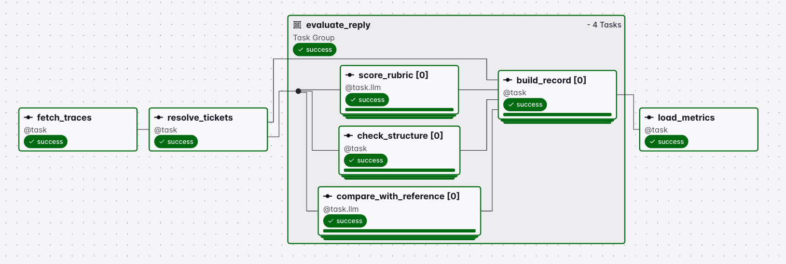

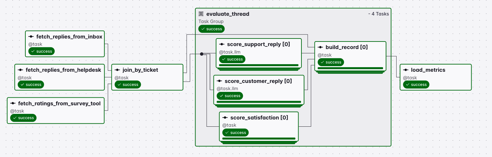

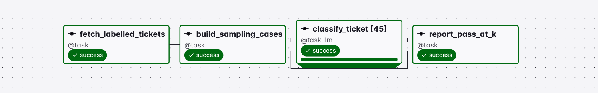

### MLOps (`dags/mlops/`)

| Dag | What it does |
|---|---|
| `train_delivery_risk_model` | Scheduled by the `cosmarket_shipment_history` asset. Trains a random forest and a logistic regression across a small hyperparameter grid in parallel, dynamically-mapped tasks, tracks every variant as its own run through `MlopsTracker`, picks the winner by macro F1 (`lost_in_transit` is a small share of the history, so accuracy alone would let a model that never predicts it win), plots it, and promotes it to the `production` stage. |
| `score_open_shipments` | Scheduled by the `cosmarket_delivery_risk_model` asset. Loads the production model, scores every in-transit shipment, upserts `shipment_predictions`, and logs the highest-confidence at-risk shipments. |

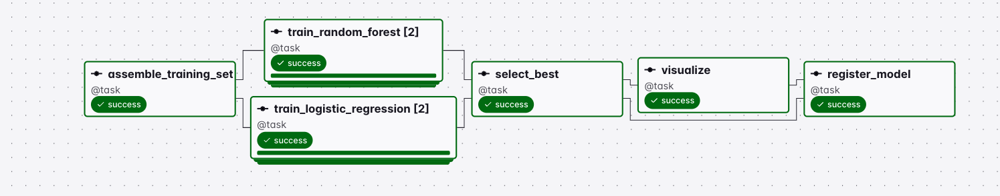

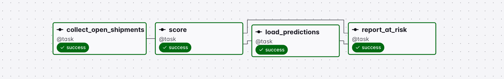

## Plugins

Two Airflow 3.1+ plugins, each a FastAPI app mounted under the Airflow API server with a top-level nav entry, both reading the same DuckDB file.

### AI Evals (`plugins/airflow-evals-plugin`)

Served at `/evals/ui`. Joins `support_thread_evals` with `support_threads`, `support_messages`, `customers`, and `products` to show each scored reply: dimension scores, confidence, token usage, cost, duration, tool calls, and a summary rate per dimension across good/acceptable/poor and low-confidence. Populated by `evaluate_support_model_responses`.

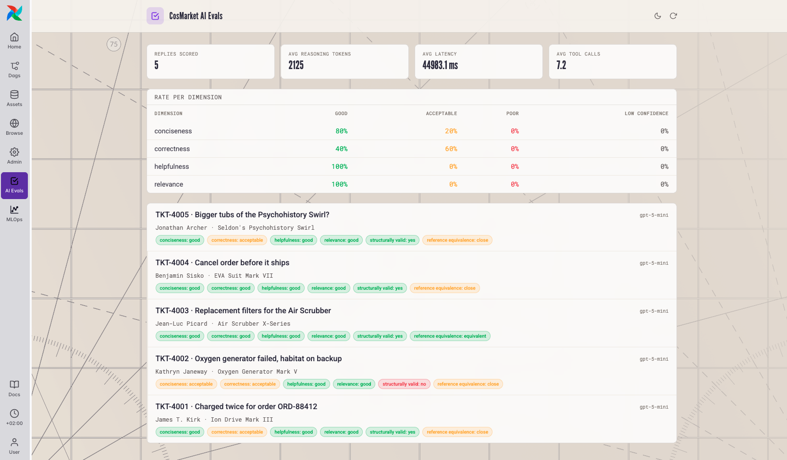

### MLOps (`plugins/airflow-mlops-plugin`)

Served at `/mlops/ui`. An experiment tracker, run history, and model registry over `ml_experiments`, `ml_runs`, `ml_models`, and `ml_plots`, populated by `train_delivery_risk_model`. It reads the DuckDB file directly here; it also supports reading from an Airflow Variable named `mlops_plugin_data` for a deployment where the API server and workers don't share a filesystem, though no Dag in this repo populates that variable.

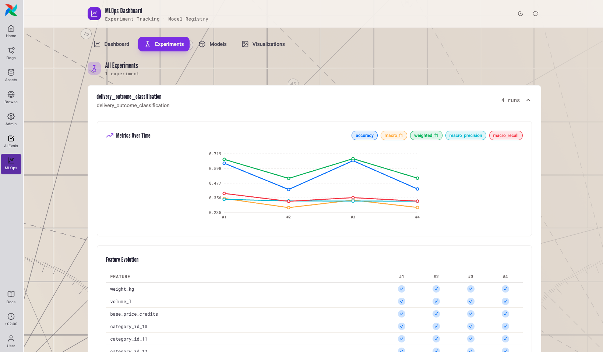

## Schema

One DuckDB file, `include/cosmarket.duckdb`, no schemas or namespaces, just tables, defined in `include/sql/cosmarket_schema.sql`:

| Tables | Used by |
|---|---|
| `customers`, `products` | Reference data seeded by `setup`, read by every Dag that needs a name or a price |
| `support_threads`, `support_messages`, `support_thread_evals` | The support agent and its eval |
| `context_units` | The context engineering pattern: chunk text, embedding, and source document |
| `shipments`, `shipment_features`, `shipment_labels`, `shipment_predictions` | The MLOps pattern: training data, labels, and scored predictions |
| `ml_experiments`, `ml_runs`, `ml_models`, `ml_plots` | The tracker and registry the MLOps plugin reads. Column name and order are what `plugin.py` selects by, so changing one without updating the plugin breaks it. |

## Tracing

The `otel-collector` container writes every OTel span Airflow and the AI providers emit, task spans and GenAI spans alike, to `traces/spans.jsonl`. `include/otel_traces.py` walks a GenAI span's parents until it finds the Airflow task span carrying `airflow.dag_id`, `airflow.task_id`, `airflow.dag_run.run_id`, and the map index, since core tracing puts those on the task span rather than on the GenAI span itself. That's how an eval Dag tells a drafting run apart from a judge run scoring it, and how a support-reply eval can tell one run's classification span from another's in a mapped task, without depending on prompt content matching.

## Resources

### ETL

- [Apache Airflow 3 Best Practices for ETL/ELT Pipelines](https://www.astronomer.io/ebooks/apache-airflow-3-best-practices-etl-elt-pipelines/)
- [Orchestrating dbt with Airflow Using Cosmos](https://www.astronomer.io/ebooks/orchestrating-dbt-with-airflow-using-cosmos/)
- [Quick Notes: Data Quality](https://www.astronomer.io/ebooks/quick-notes-data-quality/)
- [ETL Workshop](https://github.com/astronomer/devrel-public-workshops/tree/workshops/astrotrips/etl)

### Context engineering

- [AI Context Engineering with Apache Airflow](https://www.astronomer.io/ebooks/ai-context-engineering-with-apache-airflow/)

### AI orchestration

- [AI Orchestration with Apache Airflow](https://www.astronomer.io/ebooks/ai-orchestration-with-apache-airflow/)
- [AI Orchestration Overview](https://www.astronomer.io/docs/learn/ai-orchestration-overview)
- [The Common AI Provider](https://www.astronomer.io/docs/learn/airflow-common-ai-provider)
- [Human-in-the-Loop Workflows](https://www.astronomer.io/docs/learn/airflow-human-in-the-loop)
- [Self-Healing Pipelines with Otto](https://www.astronomer.io/docs/learn/airflow-otto-rca-auto-fix)
- [AI Workshop](https://github.com/astronomer/devrel-public-workshops/tree/workshops/astrotrips/ai)

### AI evals

- [AI Orchestration: Model Evals](https://www.astronomer.io/docs/learn/ai-orchestration-model-evals)
- [AI Orchestration: Product Evals](https://www.astronomer.io/docs/learn/ai-orchestration-product-evals)

### MLOps

- [MLOps 101 Workshop](https://github.com/astronomer/devrel-public-workshops/tree/workshops/astrotrips/mlops)
- [MLOps and AI Workshop](https://github.com/astronomer/devrel-public-workshops/tree/workshops/astrotrips/mlops-and-ai)

### General

- [Practical Guide to Apache Airflow 3](https://www.astronomer.io/ebooks/practical-guide-to-apache-airflow-3/)
- [Dynamic Task Mapping](https://www.astronomer.io/docs/learn/dynamic-tasks)
- [Durable Execution with the Task State Store](https://www.astronomer.io/docs/learn/airflow-task-state-store)
- [Best Practices for Testing Apache Airflow DAGs](https://www.astronomer.io/ebooks/best-practices-for-testing-apache-airflow-dags/)
- [Retry Policies](https://www.astronomer.io/docs/learn/rerunning-dags#retry-policies)
- [DAG Writing Workshop](https://github.com/astronomer/devrel-public-workshops/tree/workshops/astrotrips/dag-writing)
